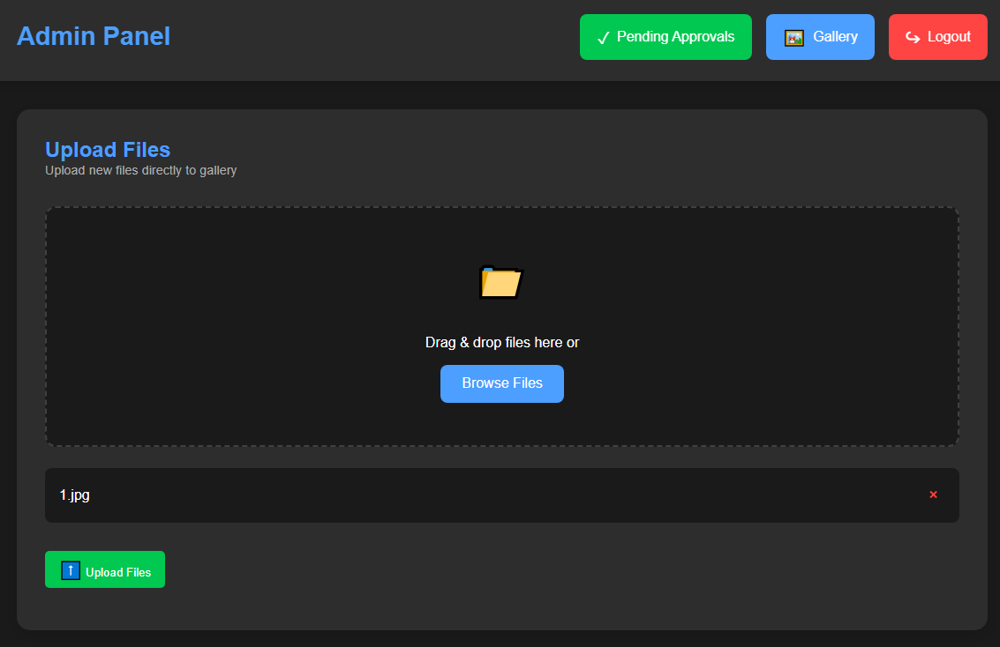
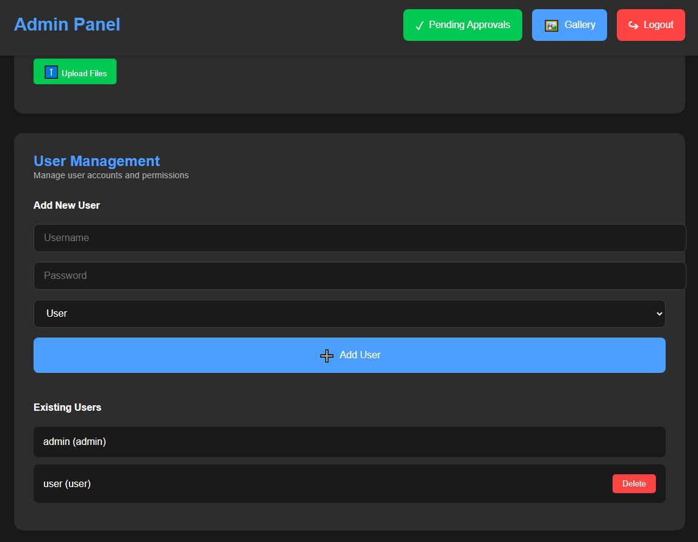
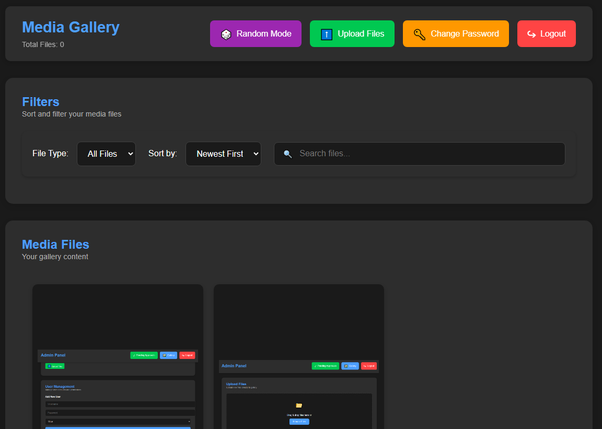
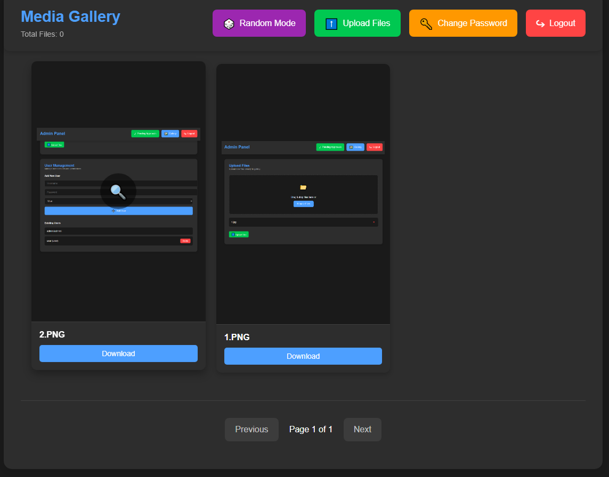
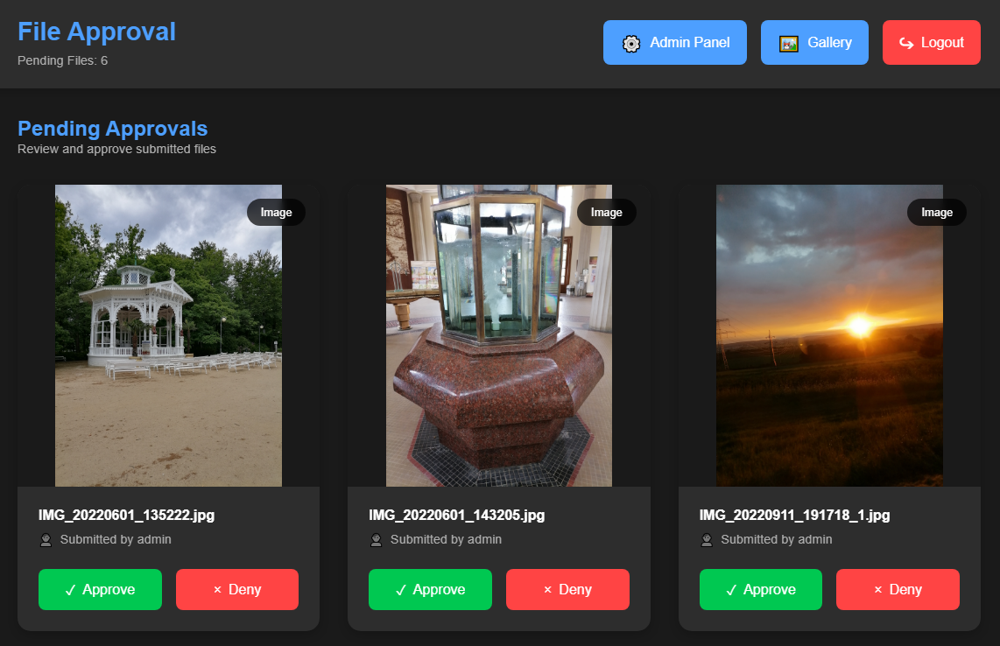

# Media Gallery Viewer

A simple and elegant web-based media gallery viewer with dark mode, filtering capabilities, and a TikTok-style random viewer mode. Features user authentication, admin panel, and file management.







## Features

- 🔒 User Authentication System
  - Secure login system
  - Admin panel for user management
  - Protected routes and API endpoints
  - Password change functionality

- 📤 File Management
  - Admin direct upload to gallery
  - User upload with approval system
  - Automatic duplicate file handling
  - Drag & drop file upload
  - Multiple file upload support
  - File type validation
  - Visual upload progress

- 🖼️ Gallery Features
  - Full-screen preview mode
  - Image/Video preview
  - Navigation between files in preview
  - Keyboard shortcuts for navigation
  - Download from preview
  - Hover preview indicators

- 📸 Media Support
  - Images: jpg, jpeg, png, gif
  - Videos: mp4, webm, ogg, mov
  - Maintains aspect ratios
  - Auto-play videos in preview

- 🎨 Interface Features
  - Modern dark mode interface
  - Responsive grid layout
  - 9:16 aspect ratio cards
  - TikTok-style random viewer
  - Enhanced UI with icons
  - Smooth animations

- 🔍 Advanced Filtering
  - File type (images/videos)
  - Search by filename
  - Sort by newest/oldest/random
  - Real-time filter updates

- 📱 Responsive Features
  - Grid layout adapts to screen size
  - Touch-friendly interface
  - Swipe navigation in preview
  - Mobile-optimized controls

## Setup Instructions

1. **Prerequisites**
   - Node.js installed on your computer
   - Basic knowledge of using terminal/command prompt

2. **Installation**
   ```bash
   # 1. Clone or download this repository
   # 2. Open terminal in the project folder
   # 3. Install dependencies
   npm install
   ```

3. **Folder Structure**
   ```
   project/
   ├── Gallery/           # Approved media files
   ├── forApprove/        # Pending approval files
   ├── server.js          # Server configuration
   ├── users.json         # User credentials
   ├── package.json       # Dependencies
   └── start.bat          # Windows startup script
   ```

4. **Default Credentials**
   ```json
   Admin User:
   Username: admin
   Password: admin123

   Regular User:
   Username: user
   Password: user123
   ```

## Usage

### File Management
- **Admin Upload:**
  1. Direct upload to gallery
  2. Automatic duplicate handling
  3. Instant availability
  4. Multiple file support

- **User Upload:**
  1. Submit files for approval
  2. Files stored in pending folder
  3. Admin review required
  4. Automatic duplicate handling

### Duplicate File Handling
- System checks for existing filenames
- Automatically adds unique suffix
- Preserves original filename
- Maintains file extension
- Example: "image.jpg" → "image_x7b.jpg"

### Preview Mode
- Full-screen media preview
- Arrow key navigation
- Click outside to close
- Download option
- Auto-play for videos

### Admin Features
- User management
- File approval system
- Direct file uploads
- User role assignment
- System monitoring

### Security Features
- Protected routes
- Session management
- Role-based access
- File type validation
- Secure file handling

## File Support
- **Images:** jpg, jpeg, png, gif
- **Videos:** mp4, webm, ogg, mov

## Keyboard Shortcuts
- `←/→` - Navigate in preview
- `ESC` - Close preview/modal
- `/` - Focus search
- `Space` - Play/pause video

## Development
- Built with Express.js
- Session authentication
- File handling with Multer
- JSON-based user storage
- Modern ES6+ JavaScript
- CSS Grid/Flexbox layout

## Notes
- Optimized for modern browsers
- Supports touch devices
- Maintains aspect ratios
- Auto-refreshes content
- Session timeout: 24 hours
- Responsive design
- Enhanced dark theme
